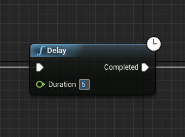
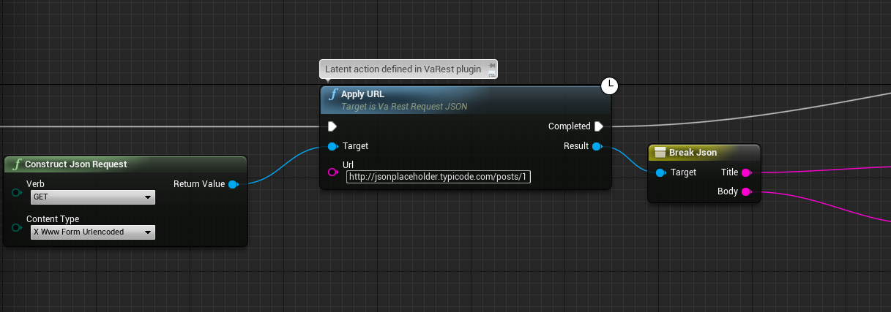
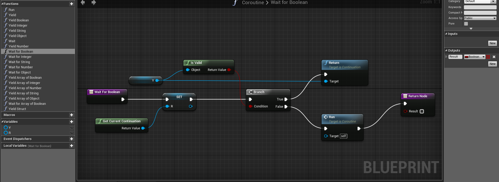

### First class continuations in UE-4 Blueprints

UE-4 Blueprints have a concept called "Latent Actions", one of the simplest being _Delay_ shown below which suspends 
the current Blueprint for the specified number of seconds and then continues with whatever is connected to the _Completed_ pin. 

 

Currently all such latent actions show that clock icon. 
Here is another example from a plugin, which suspends the Blueprint during a network operation and then continues when the result is 
available: 

In UE-4.10, latent action nodes are only allowed at the top level of a Blueprint "event graph". They become inaccessible inside of functions. This is unfortunate because you are forced to use essentially global variables in such cases, and since an event graph contains a bunch of parallel event handlers, this quickly becomes a mess. 

Blueprint graphs are in fact compiled to byte-code which is interpreted by a virtual machine written in C++. This vm uses an 
explicit stack, vm functions being of the form 

    void FUNC(FFrame &Stack, void *Result). 

The 4.10 implementation creates the vm stack on 
the C++ call stack, using alloca to reserve space for the local variables. That explains why latent actions are only allowed at the 
top level, namely due to the fact that the instruction pointer and nothing else is preserved during the callback process. By preserving
(a copy of) the entire vm call stack, this limitation can be removed. Note that local variables are shared between any such copies,
only the instruction pointer of each frame is distinct. Now the copy must be allocated on the C++ heap rather than its stack in order to
persist until the callback occurs.

I've created a fork of 4.10 that makes the rather small changes necessary to enable the general use of latent actions.
In addition, it contains some experimental Blueprint nodes to enable using continuations directly in blueprints. 
Continuations in a sense generalize function "Return" nodes and in fact can be used in place of them. 
Here is an example of a normal return node:

The below produces the same result via an explicit continuation:

Here _Return Integer_ is a function - which however itself does not return to its caller (hence it has no output pin). As you can see _Get Current Continuation_ gives you a _Continuation_ object that represents what will happen when the current function (in this case _Foo_) returns. This object can be stored in a variable and otherwise passed around. It provides a bunch of _Return_ methods like _Return Integer_ that you can call later - when you do it's as if you jump back in time and return again from the function (i.e. in this case _Foo_). You can actually do this more than once if you like and pass a different return value each time.

As an example we can implement coroutines just with Blueprints. 

Here we have two Continuation variables _Y_ and _R_. _Y_ represents the continuation of a _Yield_ operation and _R_ represents that of a _Wait for_ operation. The implementation of the _Yield_ operations save their continuation in _Y_, and of the _Wait for_ in _R_:

_Run_ is an abstract function the user implements in which _Yield_ is called. _Wait for_ is called from an event such as _Tick_ to resume the coroutine.

